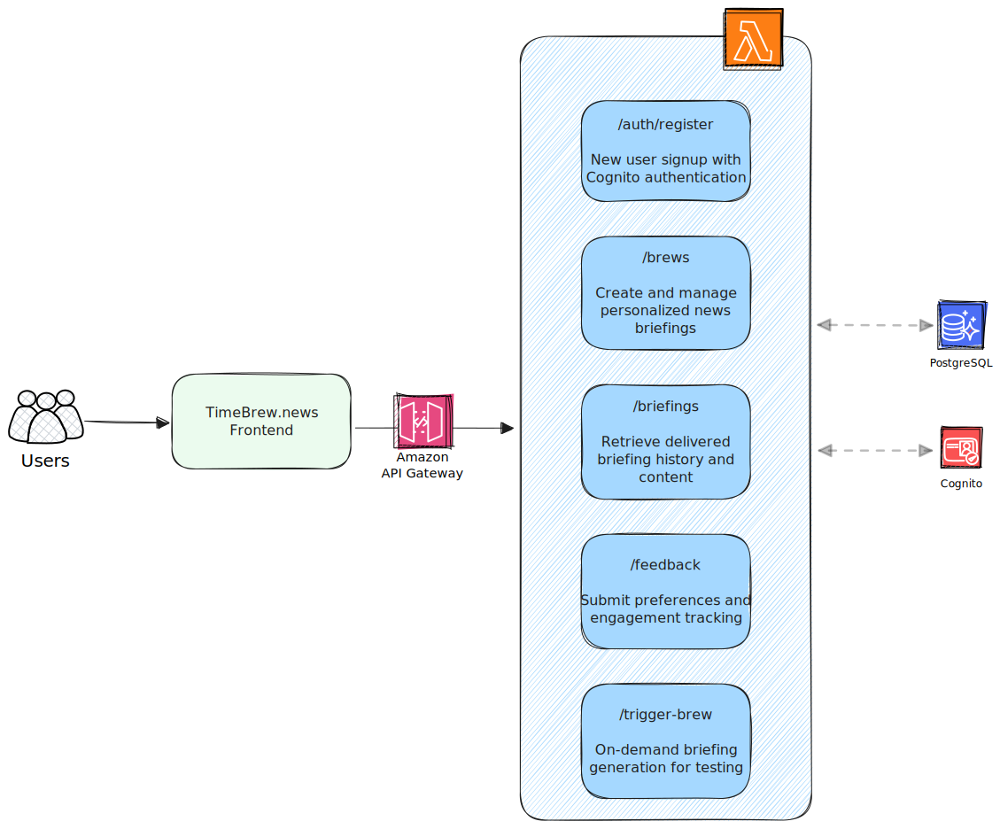

# TimeBrew Backend - Personalized AI News Curation Platform

> **"I love Morning Brew, but I wanted MY Morning Brew"**

## 🚀 The Problem

As a daily Morning Brew reader, I was inspired by their engaging writing style but frustrated by the lack of personalization. Why couldn't I get that same witty, insightful briefing format but tailored to **my** interests in AI, fintech, and emerging technologies?

Traditional news aggregators either lack personality or fail at true personalization. I wanted to solve this by building an AI-powered platform that combines Morning Brew's engaging voice with intelligent content curation - all built on serverless architecture for scale and cost efficiency.

## 🏗️ Architecture Overview

TimeBrew leverages **AWS Lambda as its core compute service** with two complementary architectural layers:

### Core AI Pipeline (Event-Driven Processing)


### RESTful API Layer (User Interface)



## 🔥 AWS Lambda Implementation

### **Multiple Lambda Triggers Showcased:**

#### 1. **EventBridge Triggers** (Scheduled Events)

```yaml
brewScheduler:
  handler: core_services/scheduler/brew_scheduler.lambda_handler
  events:
    - schedule: rate(15 minutes) # EventBridge cron trigger
```

- **Function**: Timezone-aware scheduling system
- **Trigger**: Every 15 minutes via EventBridge
- **Purpose**: Identifies brews due for delivery across global timezones

#### 2. **API Gateway Triggers** (REST Endpoints)

```yaml
functions:
  register: # User registration
  getBrews: # Brew management
  getBriefings: # Content access
  submitFeedback: # User preferences
  triggerBrew: # Manual execution
  health: # System monitoring
```

- **11 Lambda Functions** serving REST API
- **Trigger**: HTTP requests via API Gateway
- **Purpose**: Complete user interaction layer

#### 3. **Step Functions Orchestration** (Complex Workflows)

```yaml
AIPipelineStateMachine:
  States: NewsCurator → NewsEditor → EmailDispatcher
```

- **3 Lambda Functions** in orchestrated sequence
- **Trigger**: Step Functions state machine
- **Purpose**: AI-powered content generation pipeline

#### 4. **Manual Invocation** (Direct Triggers)

- **Function**: `triggerBrew` for on-demand execution
- **Purpose**: Testing and immediate briefing generation

## 🧠 Serverless AI Pipeline Deep Dive

### **Stage 1: News Curator Lambda**

```python
# core_services/ai/news_curator.lambda_handler
- Queries user preferences and feedback history
- Uses Perplexity Sonar API for real-time news search
- Applies temporal context and duplicate detection
- Returns 3-8 curated articles with relevance scoring
```

**Key Serverless Benefits:**

- **Auto-scaling**: Handles varying news volume
- **Cost optimization**: Pay only for curation time
- **Timeout management**: 600s for complex AI processing

### **Stage 2: News Editor Lambda**

```python
# core_services/ai/news_editor.lambda_handler
- Transforms raw articles into Morning Brew-style content
- Uses OpenAI GPT-4 for editorial writing
- Applies personality-based voice customization
- Generates structured JSON for email template
```

**Serverless Design Patterns:**

- **Stateless processing**: No server state management
- **Event-driven**: Triggered by Step Functions
- **Resource optimization**: 512MB memory for AI workloads

### **Stage 3: Email Dispatcher Lambda**

```python
# core_services/ai/email_dispatcher.lambda_handler
- Converts JSON to responsive HTML email
- Integrates with Amazon SES for delivery
- Tracks delivery status and user engagement
- Updates database with completion metrics
```

**Production Features:**

- **Retry logic**: Built-in error handling
- **Observability**: CloudWatch integration
- **Resource efficiency**: 256MB for email processing

## 🔧 Serverless Best Practices Implemented

### **1. Infrastructure as Code**

```yaml
# serverless.yml - Complete AWS resource definition
provider:
  name: aws
  runtime: python3.9
  region: us-east-1

resources:
  Resources:
    AIPipelineStateMachine: # Step Functions
    StepFunctionsRole: # IAM permissions
```

### **2. Environment Configuration**

```yaml
environment:
  DB_HOST: ${env:DB_HOST}
  OPENAI_API_KEY: ${env:OPENAI_API_KEY}
  PERPLEXITY_API_KEY: ${env:PERPLEXITY_API_KEY}
  SMTP_SERVER: ${env:SMTP_SERVER}
```

### **3. Security & Authentication**

- **Cognito Integration**: JWT token validation
- **IAM Roles**: Least privilege access
- **CORS Configuration**: Secure frontend integration

### **4. Error Handling & Monitoring**

```yaml
Retry:
  ErrorEquals: ["Lambda.ServiceException"]
  IntervalSeconds: 2
  MaxAttempts: 2
  BackoffRate: 2.0

Catch:
  ErrorEquals: ["States.ALL"]
  Next: "HandleError"
```

## 📊 AWS Services Integration

| Service            | Usage                       | Lambda Integration      |
| ------------------ | --------------------------- | ----------------------- |
| **AWS Lambda**     | Core compute (14 functions) | Primary service         |
| **API Gateway**    | REST API endpoints          | HTTP triggers           |
| **Step Functions** | AI pipeline orchestration   | Workflow triggers       |
| **EventBridge**    | Scheduled execution         | Cron triggers           |
| **Amazon Cognito** | User authentication         | Auth middleware         |
| **PostgreSQL**     | External database           | Persistent data storage |
| **Amazon SES**     | Email delivery              | SMTP integration        |
| **CloudWatch**     | Monitoring & logging        | Automatic integration   |

## 🎯 Real-World Business Impact

### **Problem Solved**: Information Overload

- **Before**: Generic news feeds, manual curation
- **After**: AI-powered personalization with personality

### **Scalability**: Serverless Architecture

- **Auto-scaling**: Handle 1 user or 1 million users
- **Cost efficiency**: Pay only for actual usage
- **Global reach**: Multi-timezone support

### **User Experience**: Personalized Content

- **Learning system**: Adapts to user feedback
- **Consistent quality**: AI maintains writing voice
- **Reliable delivery**: Timezone-aware scheduling

## 🚀 Getting Started

### **Prerequisites**

```bash
- AWS CLI configured
- Node.js 16+ for Serverless Framework
- Python 3.9+
- PostgreSQL database access
```

### **Deployment**

```bash
# Install dependencies
npm install -g serverless
pip install -r requirements.txt

# Configure environment
cp .env.example .env
# Add your API keys and database credentials

# Deploy to AWS
serverless deploy --stage dev
```

### **Environment Variables**

```bash
# AI Services
OPENAI_API_KEY=your_openai_key
PERPLEXITY_API_KEY=your_perplexity_key

# Database (PostgreSQL)
DB_HOST=your_postgres_host
DB_PORT=5432
DB_NAME=timebrew
DB_USER=your_db_user
DB_PASSWORD=your_db_password

# Email
SMTP_SERVER=your_smtp_server
SMTP_USERNAME=your_smtp_user
SMTP_PASSWORD=your_smtp_password

# Authentication
USER_POOL_ID=your_cognito_pool_id
CLIENT_ID=your_cognito_client_id
```

## 📈 Performance & Metrics

### **Lambda Function Performance**

- **Cold Start**: < 2 seconds (Python 3.9)
- **Execution Time**: 30s (API) / 600s (AI processing)
- **Memory Usage**: 256MB-512MB optimized per function
- **Cost**: ~$0.02 per briefing generated

### **Scalability Metrics**

- **Concurrent Executions**: Auto-scales to demand
- **Global Distribution**: Multi-region capable
- **Database Connections**: Pooled for efficiency

## 🔮 Future Enhancements

### **AI Improvements**

- **Reasoning Models**: Upgrade to OpenAI o1 for better constraint following
- **Multi-Agent Architecture**: Specialized agents for research, quality, and voice
- **Feedback Learning**: ML models trained on user interaction data

### **Platform Expansion**

- **Mobile Applications**: React Native with same Lambda backend
- **Enterprise Features**: Team briefings, custom sources
- **API Marketplace**: White-label news curation service

## 🏆 Why This Showcases AWS Lambda Excellence

### **Technical Innovation**

- **Multiple trigger types**: EventBridge, API Gateway, Step Functions
- **Complex orchestration**: Sequential AI pipeline with error handling
- **Production patterns**: Authentication, monitoring, error recovery

### **Business Value**

- **Real problem solving**: Personalized content at scale
- **Cost optimization**: Serverless economics for variable workloads
- **User experience**: Fast, reliable, intelligent news delivery

### **Architecture Excellence**

- **Serverless-first design**: No server management overhead
- **Event-driven patterns**: Reactive, scalable architecture
- **AWS best practices**: Security, monitoring, infrastructure as code

---

**TimeBrew demonstrates that AWS Lambda isn't just for simple functions - it's the foundation for building intelligent, scalable, production-ready applications that solve real-world problems.**

Built with ❤️ using AWS Lambda, Step Functions, and a passion for personalized news.
